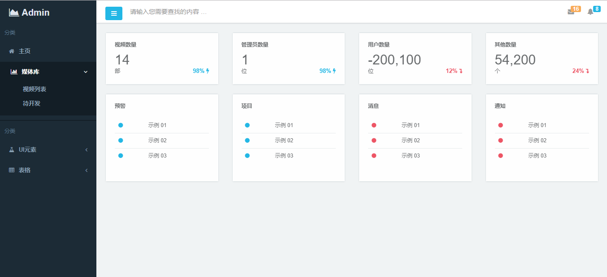
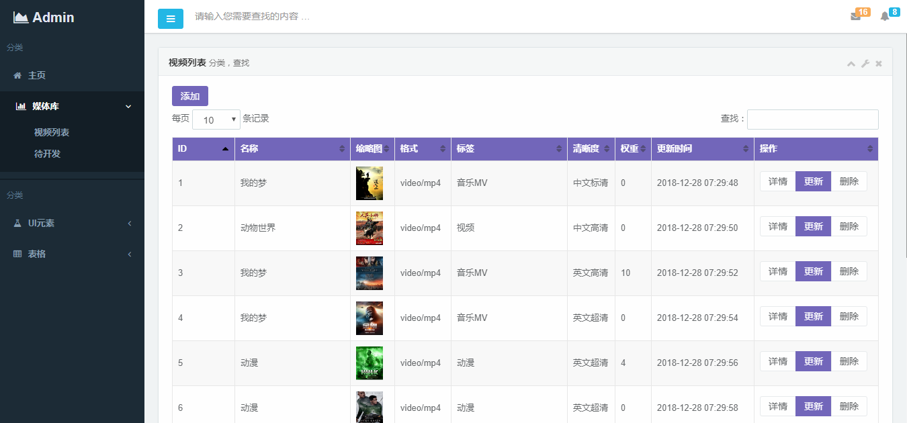

### 代码
- 欢迎Fork
- 欢迎Star

### 后台技术
- SpringBoot
- Mybatis
- Thymeleaf
- Redis
- 支持定时任务
- //Dubbo
- //Spring Cloud
form_basic.html

### 开发计划
- 后台管理开发，现在已经集成，开发进行中...
- python爬虫开发，进行中...

### 数据库
- MySql
- Druid

### 页面截图

### 解析地址
- https://api.123zx.net/m3u8/play.html?url=
- http://api.bbbbbb.me/jx/?url=
- http://app.baiyug.cn:2019/vip/?url=

### 可爬
- http://www.mp4sf.com/
- https://www.mp4ju.com/
- http://www.beiwo8888.com/